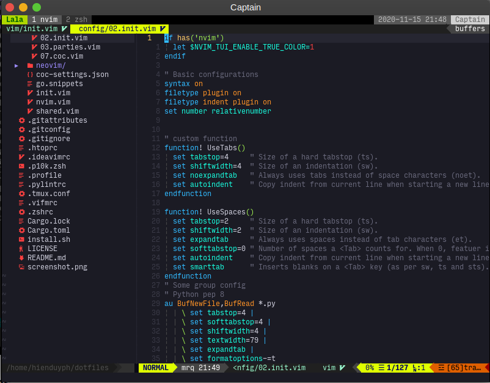

# The Q dotfiles




## Steps
```bash
# install path must be at `$HOME/dotfiles`
git clone https://github.com/hienduyph/dotfiles ~/
cd ~/dotfiles
```

### 1. Install platform base first
**In each platform**
```bash
brew bundle
```

- [Linux](./platform/linux)
- [MacOs](./platform/darwin)

### 2. Bootstrap dotfiles
```bash
bash ./install.sh
```


## Q Utils
*Install [Rust](https://www.rust-lang.org/tools/install)*

```
$ cargo build --release
$ cp ./target/release/yaml2json ~/.local/bin
```

## Misc
### Install latest nvim?
```
curl -fsSL https://github.com/neovim/neovim/releases/download/nightly/nvim-linux64.tar.gz | tar xz --strip-components=1 -C /opt/neovim
# or macos
curl -fsSL https://github.com/neovim/neovim/releases/download/nightly/nvim-macos.tar.gz | tar xz --strip-components=1 -C /opt/neovim
```

# License
[MIT License](LICENSE)

